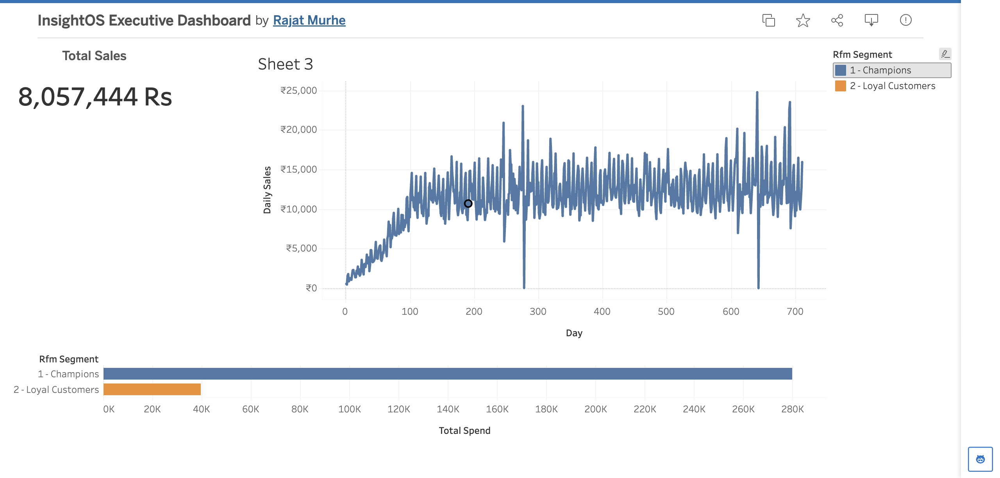

# InsightOS: Enterprise Data & AI Pipeline

An end-to-end data analytics and artificial intelligence pipeline built to process raw retail transactions, monitor system health, and generate automated business intelligence.

This project tackles the complex challenge of big data observability by connecting a **PostgreSQL Data Warehouse** directly with an **Isolation Forest Machine Learning Model**. By integrating advanced SQL analytics, unsupervised anomaly detection, and an automated GenAI reporting engine, this platform delivers a transparent, intelligent, and highly responsive retail monitoring system.

    

> *Time-series revenue tracking, statistical anomaly detection, and RFM (Recency, Frequency, Monetary) customer segmentation.*

[](https://public.tableau.com/app/profile/rajat.murhe/viz/InsightOSExecutiveDashboard/Dashboard1)

**🔗 [Click Here to View the Interactive Tableau Public Dashboard](https://public.tableau.com/app/profile/rajat.murhe/viz/InsightOSExecutiveDashboard/Dashboard1)**

---

## 🚀 Project Pipeline: What We Built

This project was developed in five distinct phases, taking a raw dataset and transforming it into a full-stack data product.

### 1. Data Engineering & Warehousing
*   **Infrastructure Setup:** Architected a local relational database using **PostgreSQL**.
*   **ETL Pipeline:** Developed a Python ingestion script using `SQLAlchemy` and `Pandas` to clean, format, and load raw CSV transaction data into optimized database tables.

### 2. Advanced SQL Analytics
*   **KPI Generation:** Designed complex SQL queries leveraging Common Table Expressions (CTEs) and aggregation functions to calculate top-level business metrics (Total Revenue, Average Order Value).
*   **Customer Segmentation:** Engineered an **RFM (Recency, Frequency, Monetary)** scoring model entirely in SQL to categorize the user base into distinct cohorts (e.g., "Champions", "Loyal Customers") based on their purchasing behavior.

### 3. Machine Learning (Anomaly Detection)
*   **Algorithm Deployment:** Implemented an unsupervised **Isolation Forest** machine learning model using `scikit-learn`. 
*   **Behavioral Monitoring:** Rather than profiling normal behavior, the model actively isolates unusual revenue observations. Configured with a 3% contamination threshold, the AI successfully flagged severe system tracking failures (revenue dropping to near-zero) and extreme bulk-order spikes.

### 4. Generative AI Prompt Engineering
*   **Explainability Layer:** Built a dynamic Python module that intercepts the anomalous dataframes generated by the ML model.
*   **Automated Context Injection:** The script engineers a highly structured prompt, injecting the exact mathematical outliers into a context window designed for Large Language Models (LLMs) to automatically generate categorization and executive email alerts.

### 5. Business Intelligence & Visualization
*   **Dashboard Architecture:** Connected the processed PostgreSQL exports to **Tableau**.
*   **Visual Correlation:** Designed an executive dashboard featuring a time-series line chart that visually proves the machine learning model's findings, alongside the RFM customer distribution and core KPIs.

---

## 📁 Repository Structure

```text
InsightOS/
├── README.md
├── requirements.txt
├── export_trend.py
├── llm_executive_prompt.txt
├── data/
│   ├── raw/
│   └── dashboard/
│       ├── customer_rfm.csv
│       ├── daily_sales.csv
│       ├── kpis_executive.csv
│       └── visual.png
└── src/
    ├── pipeline/
    └── anomaly/
        ├── sales_anomaly.py
        └── llm_alert.py
